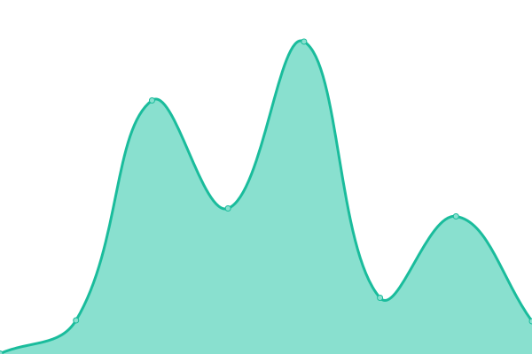

# [📈 Live Status](https://demo.upptime.js.org): <!--live status--> **🟥 Complete outage**

This repository contains the open-source uptime monitor and status page for [Russel Villacarlos](https://demo.upptime.js.org), powered by [Upptime](https://github.com/upptime/upptime).

With [Upptime](https://upptime.js.org), you can get your own unlimited and free uptime monitor and status page, powered entirely by a GitHub repository. We use [Issues](https://github.com/rlvillacarlos/cvsu-site-monitor/issues) as incident reports, [Actions](https://github.com/rlvillacarlos/cvsu-site-monitor/actions) as uptime monitors, and [Pages](https://demo.upptime.js.org) for the status page.

<!--start: status pages-->
<!-- This summary is generated by Upptime (https://github.com/upptime/upptime) -->
<!-- Do not edit this manually, your changes will be overwritten -->
<!-- prettier-ignore -->
| URL | Status | History | Response Time | Uptime |
| --- | ------ | ------- | ------------- | ------ |
|  [Website](https://cvsu.edu.ph) | 🟥 Down | [website.yml](https://github.com/rlvillacarlos/cvsu-site-monitor/commits/HEAD/history/website.yml) | 

 1408ms
     
 | 

<a href="https://rlvillacarlos.github.io/cvsu-site-monitor/history/website">35.60%</a>
    

|  [Registrar](https://registrar.cvsu.edu.ph) | 🟥 Down | [registrar.yml](https://github.com/rlvillacarlos/cvsu-site-monitor/commits/HEAD/history/registrar.yml) | 

 683ms
     
 | 

<a href="https://rlvillacarlos.github.io/cvsu-site-monitor/history/registrar">35.60%</a>
    

|  [Admission](https://admission.cvsu.edu.ph) | 🟥 Down | [admission.yml](https://github.com/rlvillacarlos/cvsu-site-monitor/commits/HEAD/history/admission.yml) | 

 533ms
     
 | 

<a href="https://rlvillacarlos.github.io/cvsu-site-monitor/history/admission">35.60%</a>
    

|  [HR](https://hr.cvsu.edu.ph) | 🟥 Down | [hr.yml](https://github.com/rlvillacarlos/cvsu-site-monitor/commits/HEAD/history/hr.yml) | 

 1477ms
     
 | 

<a href="https://rlvillacarlos.github.io/cvsu-site-monitor/history/hr">35.60%</a>
    

|  [Student Portal](https://myportal.cvsu.edu.ph) | 🟥 Down | [student-portal.yml](https://github.com/rlvillacarlos/cvsu-site-monitor/commits/HEAD/history/student-portal.yml) | 

 591ms
     
 | 

<a href="https://rlvillacarlos.github.io/cvsu-site-monitor/history/student-portal">35.60%</a>
    

|  [LMS](https://elearning.cvsu.edu.ph) | 🟥 Down | [lms.yml](https://github.com/rlvillacarlos/cvsu-site-monitor/commits/HEAD/history/lms.yml) | 

 1338ms
     
 | 

<a href="https://rlvillacarlos.github.io/cvsu-site-monitor/history/lms">35.60%</a>
    

|  [Library](http://library.cvsu.edu.ph) | 🟥 Down | [library.yml](https://github.com/rlvillacarlos/cvsu-site-monitor/commits/HEAD/history/library.yml) | 

 4804ms
     
 | 

<a href="https://rlvillacarlos.github.io/cvsu-site-monitor/history/library">35.24%</a>
    

|  [PPMP](http://ppmp.cvsu.edu.ph) | 🟥 Down | [ppmp.yml](https://github.com/rlvillacarlos/cvsu-site-monitor/commits/HEAD/history/ppmp.yml) | 

 818ms
     
 | 

<a href="https://rlvillacarlos.github.io/cvsu-site-monitor/history/ppmp">35.59%</a>
    

<!--end: status pages-->

[**Visit our status website →**](https://rlvillacarlos.github.io/cvsu-site-monitor)

## 📄 License

- Powered by: [Upptime](https://github.com/upptime/upptime)
- Code: [MIT](./LICENSE) © [Russel Villacarlos](https://demo.upptime.js.org)
- Data in the `./history` directory: [Open Database License](https://opendatacommons.org/licenses/odbl/1-0/)
